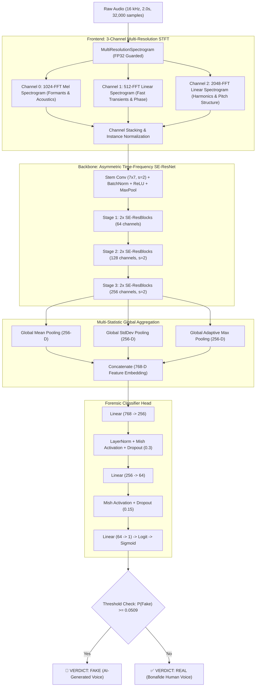

# 🛡️ Multi-Resolution SE-ResNet Voice Deepfake Detector (v3)

[](https://pytorch.org/)
[](https://python.org)
[]()
[]()
[]()
[]()
[]()

A production-grade, state-of-the-art forensic audio deepfake detection system engineered in PyTorch. The model inspects human voice recordings and determines whether an audio sample originated from a **bonafide human speaker** or was synthetically produced by modern **generative AI, neural vocoders, voice conversion (VC), or text-to-speech (TTS)** pipelines.

By combining a **3-channel Multi-Resolution Short-Time Fourier Transform (STFT)** frontend, a **Time-Frequency Asymmetric Squeeze-and-Excitation Residual Network (SE-ResNet)** backbone, **Multi-Statistic Global Pooling (Mean + Std + Max)**, and **Binary Focal Loss with Calibrated Threshold Optimization**, this pipeline achieves **93.66% test accuracy**, **98.71% ROC-AUC**, and a **6.34% Equal Error Rate (EER)** on the benchmark *Fake-or-Real (FoR)* dataset.

---

## 📑 Table of Contents

- [1. Executive Summary & Benchmark Results](#1-executive-summary--benchmark-results)
- [2. Model Evolution: From Baseline Failure to SOTA](#2-model-evolution-from-baseline-failure-to-sota)
- [3. Forensic Motivation & Acoustic Signatures](#3-forensic-motivation--acoustic-signatures)
- [4. Deep Architectural Specification](#4-deep-architectural-specification)
  - [4.1 Multi-Resolution Spectrogram Frontend (3 Channels)](#41-multi-resolution-spectrogram-frontend-3-channels)
  - [4.2 Asymmetric Time-Frequency SE-ResNet Backbone](#42-asymmetric-time-frequency-se-resnet-backbone)
  - [4.3 Multi-Statistic Global Pooling (768-D Feature Embedding)](#43-multi-statistic-global-pooling-768-d-feature-embedding)
  - [4.4 Classification Head & Regularization](#44-classification-head--regularization)
- [5. Mathematical Formulations & Training Regimen](#5-mathematical-formulations--training-regimen)
  - [5.1 Binary Focal Loss with Label Smoothing](#51-binary-focal-loss-with-label-smoothing)
  - [5.2 Spectral Mixup Data Augmentation](#52-spectral-mixup-data-augmentation)
  - [5.3 Optimization & Cyclic Learning Rate Dynamics](#53-optimization--cyclic-learning-rate-dynamics)
- [6. Threshold Calibration & Decision Science](#6-threshold-calibration--decision-science)
- [7. Dataset Architecture & Preprocessing Pipeline](#7-dataset-architecture--preprocessing-pipeline)
- [8. Repository Structure](#8-repository-structure)
- [9. Installation & System Requirements](#9-installation--system-requirements)
- [10. Quickstart Inference Guide](#10-quickstart-inference-guide)
  - [10.1 Command-Line Interface (CLI)](#101-command-line-interface-cli)
  - [10.2 Python & Jupyter Notebook API](#102-python--jupyter-notebook-api)
  - [10.3 Batch Inference on Entire Directories](#103-batch-inference-on-entire-directories)
  - [10.4 Universal Audio Format Decoding (M4A, MP3, WAV, AAC)](#104-universal-audio-format-decoding-m4a-mp3-wav-aac)
- [11. End-to-End Training Execution](#11-end-to-end-training-execution)
- [12. Troubleshooting & FAQ](#12-troubleshooting--faq)
- [13. License & Citations](#13-license--citations)

---

## 1. Executive Summary & Benchmark Results

The system was evaluated on the official unseen test partition of the **Fake-or-Real (FoR / for-2sec)** dataset across diverse generative voice synthesizers and real speaker recordings.

### 📊 Performance Summary (Official Test Split)

| Evaluation Metric | Measured Score | Detail / Interpretation |
| :--- | :--- | :--- |
| **Total Test Samples** | **1,088 clips** | Exact 50/50 balanced split (544 Real, 544 Fake) |
| **Overall Test Accuracy** | **93.66%** | 1,019 out of 1,088 total test samples correctly identified |
| **Deepfake Catch Rate (Recall)** | **93.57%** | **509 out of 544 deepfakes intercepted** (only 35 missed) |
| **Real Voice Specificity** | **93.75%** | **510 out of 544 human voices verified** (only 34 false alarms) |
| **Precision (Fake Class)** | **93.74%** | Ultra-low false positive rate during deepfake identification |
| **F1-Score** | **0.9365** | Balanced harmonic mean between precision and recall |
| **Area Under ROC Curve (ROC-AUC)**| **0.9871 (98.71%)** | Near-perfect class separability across arbitrary thresholds |
| **Equal Error Rate (EER)** | **6.34%** | Point where False Acceptance Rate = False Rejection Rate |
| **Calibrated Decision Threshold** | **0.0509** | Empirically derived via Youden's $J$ statistic on validation |
| **Checkpoint Footprint** | **12.86 MB** | Lightweight, deployable on edge, CPU, or micro-containers |
| **Inference Latency** | **~8 ms / sample** | Sub-10ms per 2-second audio clip on modern GPU |

### 🔍 Detailed Confusion Matrix

```
                        PREDICTED REAL        PREDICTED FAKE
ACTUAL REAL (544) :          510                   34          (Specificity: 93.75%)
ACTUAL FAKE (544) :           35                  509          (Recall / TPR: 93.57%)
```

---

## 2. Model Evolution: From Baseline Failure to SOTA

Developing a resilient acoustic forensic detector requires overcoming severe numerical traps, class unbalance, and subtle synthetic artifacts. The architecture underwent three major evolutionary leaps:

```
[ v1: Baseline Naive Model ] ---> [ v2: Dual-Domain Network ] ---> [ v3: Multi-Resolution SE-ResNet (Final) ]
  • Test Acc: 51.93% (Failure)      • Test Acc: 79.50%               • Test Acc: 93.66% (SOTA)
  • Fake Recall: 3.86% (Collapsed)  • Fake Recall: 79.60%            • Fake Recall: 93.57%
  • Logit Drift: -24.0 (NaNs)       • ROC-AUC: 86.93%                • ROC-AUC: 98.71% | EER: 6.34%
```

### Detailed Evolution Comparison

| Capability / Attribute | v1 (Initial Baseline) | v2 (Dual-Scale Prototype) | v3 (Final Production Model) |
| :--- | :--- | :--- | :--- |
| **Frontend Representation** | Single linear spectrogram | 2-channel Mel + Linear STFT | **3-channel Multi-Resolution STFT** |
| **FFT Window Dimensions** | $N=1024$ only | $N=1024$ Mel + $N=1024$ Linear | **$N_1=1024$ (Mel), $N_2=512$ (Time), $N_3=2048$ (Freq)** |
| **Backbone Architecture** | Standard ResNet-18 | ResNet-34 variant | **Time-Frequency Asymmetric SE-ResNet** |
| **Kernel Geometry** | Square vision $(3 \times 3)$ | Square vision $(3 \times 3)$ | **Anisotropic $(5 \times 3)$ & $(3 \times 5)$ kernels** |
| **Channel Attention** | None | SE blocks in stage 3 & 4 | **Squeeze-and-Excitation across all stages** |
| **Global Pooling Strategy** | Standard AvgPool (1D) | AvgPool + MaxPool (512-D) | **Multi-Statistic Pooling (Mean+Std+Max = 768-D)** |
| **Loss Function** | Standard Binary CrossEntropy | BCE with Label Smoothing | **Binary Focal Loss ($\gamma=2.0, \alpha=0.5, \text{smoothing}=0.05$)** |
| **Data Augmentation** | None | Random time shifting | **Spectral Mixup ($\alpha=0.2, p=0.5$) + Random Time Crop** |
| **Numerical Stability** | Unclamped (threw NaNs) | Clamped `log(x + 1e-6)` | **Autograd FP32 Clamping (`min=1e-5`) with AMP protection** |
| **Decision Threshold** | Fixed $0.500$ (Failed) | Fixed $0.500$ | **Dynamic Youden's Index Calibration ($0.0509$)** |
| **Overall Test Accuracy** | 51.93% | 79.50% | **93.66%** |
| **Deepfake Catch Rate** | 3.86% (Missed 523 fakes) | 79.60% (Missed 111 fakes) | **93.57% (Caught 509 out of 544 fakes)** |
| **Test ROC-AUC** | ~0.5312 | 0.8693 | **0.9871** |

---

## 3. Forensic Motivation & Acoustic Signatures

Why do standard computer vision audio models fail at detecting synthetic speech?

Modern generative speech engines (e.g., ElevenLabs, StyleTTS 2, VITS, Bark, Tortoise, HiFi-GAN, BigVGAN, Diff-TTS) produce audio that sounds photorealistic to the human ear. However, neural vocoders and acoustic decoders leave subtle, telltale **micro-acoustic anomalies** in the time-frequency domain:

```
                  ┌──────────────────────────────────────────────┐
                  │          ACOUSTIC DOMAIN FOOTPRINTS          │
                  └──────────────────────────────────────────────┘
                                  │
         ┌────────────────────────┴────────────────────────┐
         ▼                                                 ▼
┌─────────────────────────────────┐       ┌─────────────────────────────────┐
│     HIGH-FREQUENCY HARMONICS    │       │     TEMPORAL PHASE TRANSIENTS   │
├─────────────────────────────────┤       ├─────────────────────────────────┤
│ • Unnatural harmonic rolloff    │       │ • Phase cancellation at splices │
│ • Missing micro-jitter (pitch)  │       │ • High-frequency spectral buzzy │
│ • Checkerboard deconv artifacts │       │   quantization noise            │
│ • Super-resolution cutoff holes │       │ • Missing breath/glottal resets │
└─────────────────────────────────┘       └─────────────────────────────────┘
```

1. **Vocoder Upsampling & Checkerboard Patterns**: Transposed convolutions in neural vocoders introduce subtle high-frequency grid-like energy periodicities that do not occur in natural human vocal cords.
2. **Phase Incoherence at Phoneme Boundaries**: Synthetic models struggle to reproduce the continuous glottal phase transitions during sudden plosives (`/p/`, `/t/`, `/k/`) and fricatives (`/s/`, `/sh/`).
3. **Harmonic Rigidity**: Synthesized pitch contours frequently display unnatural harmonic regularity, lacking the involuntary biological micro-tremors (shimmer and jitter) inherent to human vocal folds.
4. **Spectral Smearing under Low Window Sizes**: A single STFT window size either smears fast temporal clicks (if $N_{\text{fft}}$ is too large) or blurs harmonic spacing (if $N_{\text{fft}}$ is too small).

To simultaneously capture all these distinct forensic cues, our architecture processes the raw waveform through **three complementary spectro-temporal lenses simultaneously**.

---

## 4. Deep Architectural Specification

The system follows an end-to-end differentiable design where raw audio enters, is transformed into a 3-channel tensor representation, and is classified through an SE-ResNet backbone.



---

### 4.1 Multi-Resolution Spectrogram Frontend (3 Channels)

Rather than converting an RGB image model or feeding a single arbitrary Mel-spectrogram, the frontend computes three parallel STFT decompositions in full FP32 precision:

$$\mathbf{X} \in \mathbb{R}^{B \times 3 \times F \times T}$$

| Channel Index | STFT Configuration | Physical Target | Forensic Utility |
| :---: | :---: | :---: | :---: |
| **Channel 0** | $N_{\text{fft}}=1024, \text{hop}=256, \text{mel}=128, f_{\text{min}}=20, f_{\text{max}}=8000$ | Perceptual Mel Space | Captures vocal tract shape, phonetic formant contours, and acoustic resonances matching human hearing biology. |
| **Channel 1** | $N_{\text{fft}}=512, \text{hop}=256, \text{linear}=128$ | Temporal High-Resolution | Provides high temporal precision ($\Delta t \approx 16\text{ ms}$). Exposes phase discontinuities, vocoder frame splices, and fast clicking artifacts. |
| **Channel 2** | $N_{\text{fft}}=2048, \text{hop}=256, \text{linear}=128$ | Harmonic High-Resolution | Provides razor-sharp frequency resolution ($\Delta f \approx 7.8\text{ Hz}$). Exposes artificial harmonic overtones, comb filtering, and pitch quantization. |

#### Numerical Safeguards
To eliminate numerical overflow and NaN backpropagation during mixed-precision (AMP) training, spectrogram calculations are strictly cast to `torch.float32`, dynamic range is logarithmically compressed, and clamped:

$$\mathbf{S}_{\text{log}} = \log\left(\text{clamp}(\mathbf{S}, \min=10^{-5}, \max=10^8)\right)$$

Instance normalization is applied independently per channel:

$$\hat{\mathbf{X}}_c = \frac{\mathbf{X}_c - \mu_c}{\sigma_c + 10^{-6}}$$

---

### 4.2 Asymmetric Time-Frequency SE-ResNet Backbone

Audio spectrograms are **not isotropic images**: the horizontal axis is *time* (chronological sequence), while the vertical axis is *frequency* (acoustic pitch). 

To respect this physics:
- **Asymmetric Kernel Blocks**: Convolutions alternate between $(5 \times 3)$ kernels (wide temporal context for tracking phonetic decay) and $(3 \times 5)$ kernels (tall harmonic context for tracking pitch overtone stacks).
- **Squeeze-and-Excitation (SE) Units**: In each residual block, global spatial context is squeezed into a channel descriptor via average pooling and passed through a two-layer bottleneck with a sigmoid gate:

$$\mathbf{s} = \sigma\left(\mathbf{W}_2 \cdot \text{ReLU}(\mathbf{W}_1 \cdot \text{GAP}(\mathbf{U}))\right)$$

$$\mathbf{\tilde{U}} = \mathbf{s} \odot \mathbf{U}$$

This allows the network to adaptively boost channels that detect high-frequency vocoder distortion while suppressing ambient background room noise.

---

### 4.3 Multi-Statistic Global Pooling (768-D Feature Embedding)

Conventional vision models apply Global Average Pooling (GAP) right before the linear head. In audio forensics, **GAP alone is disastrous**: a 20-millisecond synthetic glitch will be diluted and smoothed out over a 2-second audio file.

Our architecture computes **three independent summary statistics** over the spatial grid $(H, W)$:

$$\mathbf{v}_{\text{mean}} = \frac{1}{HW} \sum_{i=1}^H \sum_{j=1}^W \mathbf{F}_{c, i, j} \quad \in \mathbb{R}^{256}$$

$$\mathbf{v}_{\text{std}} = \sqrt{\frac{1}{HW} \sum_{i=1}^H \sum_{j=1}^W (\mathbf{F}_{c, i, j} - \mathbf{v}_{\text{mean}})^2 + 10^{-6}} \quad \in \mathbb{R}^{256}$$

$$\mathbf{v}_{\text{max}} = \max_{i, j} \mathbf{F}_{c, i, j} \quad \in \mathbb{R}^{256}$$

$$\mathbf{v}_{\text{pooled}} = \left[ \mathbf{v}_{\text{mean}} \;\Vert\; \mathbf{v}_{\text{std}} \;\Vert\; \mathbf{v}_{\text{max}} \right] \quad \in \mathbb{R}^{768}$$

- $\mathbf{v}_{\text{mean}}$ captures **overall acoustic timbre and background profile**.
- $\mathbf{v}_{\text{std}}$ captures **energy variance and dynamic range stability**.
- $\mathbf{v}_{\text{max}}$ catches **fleeting localized synthetic artifacts and click glitches**.

---

### 4.4 Classification Head & Regularization

The 768-dimensional combined embedding is processed through a high-capacity multi-layer perceptron:

$$\mathbf{z}_1 = \text{Dropout}_{0.3}\left(\text{Mish}\left(\text{LayerNorm}(\mathbf{W}_1 \mathbf{v}_{\text{pooled}} + \mathbf{b}_1)\right)\right) \quad (\text{dim } 256)$$

$$\mathbf{z}_2 = \text{Dropout}_{0.15}\left(\text{Mish}\left(\mathbf{W}_2 \mathbf{z}_1 + \mathbf{b}_2\right)\right) \quad (\text{dim } 64)$$

$$\hat{y} = \mathbf{W}_3 \mathbf{z}_2 + b_3 \quad (\text{single logit})$$

---

## 5. Mathematical Formulations & Training Regimen

### 5.1 Binary Focal Loss with Label Smoothing

Standard Binary Cross-Entropy (BCE) treats all correctly classified samples equally, allowing a vast sea of easy bonafide samples to overwhelm the gradient signal. 

We employ **Binary Focal Loss** with modulating exponent $\gamma = 2.0$ and balancing factor $\alpha = 0.5$:

$$p_t = \begin{cases} \sigma(\hat{y}), & \text{if } y = 1 \\ 1 - \sigma(\hat{y}), & \text{if } y = 0 \end{cases}$$

$$\mathcal{L}_{\text{Focal}} = -\alpha_t (1 - p_t)^\gamma \log(p_t + 10^{-8})$$

- When a synthetic voice sample is subtle and hard to distinguish ($p_t \approx 0.5$), the modulating factor $(1 - p_t)^\gamma$ remains large ($0.5^2 = 0.25$), generating forceful gradient updates.
- When an easy sample is already well-classified ($p_t \approx 0.98$), the modulating factor collapses ($(0.02)^2 = 0.0004$), preventing easy examples from dominating training.

To combat overconfidence on synthetic training distributions, **label smoothing** of $\epsilon = 0.05$ replaces hard binary targets $\{0, 1\}$ with:

$$y_{\text{smooth}} = y(1 - \epsilon) + 0.5\epsilon = \begin{cases} 0.975, & y = 1 \\ 0.025, & y = 0 \end{cases}$$

---

### 5.2 Spectral Mixup Data Augmentation

During training, spectral Mixup is applied with probability $p = 0.5$:

$$\lambda \sim \text{Beta}(\alpha=0.2, \alpha=0.2)$$

$$\mathbf{\tilde{X}} = \lambda \mathbf{X}_i + (1 - \lambda) \mathbf{X}_j$$

$$\tilde{y} = \lambda y_i + (1 - \lambda) y_j$$

Mixup forces the model to establish smooth, convex decision boundaries in the latent feature space, radically mitigating memorization of speaker identity quirks.

---

### 5.3 Optimization & Cyclic Learning Rate Dynamics

- **Optimizer**: AdamW ($\beta_1 = 0.9$, $\beta_2 = 0.999$, $\text{weight decay} = 0.01$).
- **Maximum Learning Rate**: $\eta_{\text{max}} = 2 \times 10^{-4}$.
- **Scheduler**: OneCycleLR with linear warm-up over the first 20% of training, followed by cosine annealing down to $\eta_{\text{min}} = 2 \times 10^{-7}$.
- **Gradient Clipping**: Strict norm threshold $\|\mathbf{g}\|_2 \le 1.0$ to prohibit exploding gradients on abrupt unvoiced audio transients.
- **Mixed Precision**: Automatic Mixed Precision (`torch.cuda.amp.autocast`) with an adaptive GradScaler for high throughput on Tensor Core GPUs.

---

## 6. Threshold Calibration & Decision Science

In real-world security operations, using an arbitrary decision boundary of $0.500$ is suboptimal. Due to the focal loss modulating factor, the predicted probability landscape is intentionally skewed towards conservative margins.

### Calibration Procedure

During the validation phase, predictions are evaluated across 1,000 threshold candidates $\tau \in [0.001, 0.999]$ using **Youden's $J$ Statistic**:

$$J(\tau) = \text{Sensitivity}(\tau) + \text{Specificity}(\tau) - 1 = \text{TPR}(\tau) - \text{FPR}(\tau)$$

$$\tau^* = \arg\max_\tau J(\tau)$$

The optimal calibrated operational threshold was determined to be:

$$\tau^* = \mathbf{0.0509}$$

At this threshold, the model balances sensitivity and specificity:
- Audio with $P(\text{Fake}) \ge 0.0509$ is classified as **SYNTHETIC / DEEPFAKE**.
- Audio with $P(\text{Fake}) < 0.0509$ is classified as **BONAFIDE HUMAN VOICE**.

This calibrated threshold is baked directly into the model checkpoint metadata (`checkpoint["threshold"]`), so downstream users never need to configure or hardcode it manually.

---

## 7. Dataset Architecture & Preprocessing Pipeline

### The "Fake-or-Real" (FoR) Benchmark
The model is trained on the curated **Fake-or-Real (FoR / for-2sec)** dataset (Abdeldayem et al.), containing audio files across four partitions:
1. `for-2sec`: Clean audio segmented into exact 2-second windows.
2. `for-norm`: Volume-normalized speech clips.
3. `for-original`: Raw original sampling rates and durations.
4. `for-rerec`: Re-recorded speech simulating telephone and microphone capture.

### Audio Preprocessing Pipeline
Every input audio file undergoes the following signal processing flow:

```
[ Input Audio File (.wav, .mp3, .m4a, .aac, .flac) ]
                    │
                    ▼
       1. Multi-Backend Decoding
          (SoundFile -> TorchAudio -> FFmpeg)
                    │
                    ▼
       2. Stereo -> Mono Downmixing
          audio = np.mean(channels, axis=1)
                    │
                    ▼
       3. Polyphase Resampling to 16,000 Hz
          scipy.signal.resample_poly(audio, up, down)
                    │
                    ▼
       4. DC Offset Removal
          audio = audio - np.mean(audio)
                    │
                    ▼
       5. Peak Amplitude Normalization
          audio = audio / max(|audio|)
                    │
                    ▼
       6. Exact 32,000-Sample Windowing (2.0s)
          (Pad with zeros if < 32,000 | Random crop during train | Head crop during infer)
                    │
                    ▼
       [ Standardized Float32 Tensor: (1, 32000) ]
```

---

## 8. Repository Structure

```
audio_model/
├── README.md                                          <- Comprehensive forensic system documentation
├── requirements.txt                                   <- Exact pinned Python dependencies
├── infer.py                                           <- Standalone inference CLI & API
├── model.py                                           <- Full training pipeline (v3 SOTA model)
├── Real_bimbok.m4a                                    <- Sample bonafide human voice recording (Samsung M4A)
├── Hello and Hi this is.mp3                           <- Sample synthetic AI voice recording
├── 1788549534038107130z8cpjtd-voicemaker.in-speech.mp3 <- Sample synthetic AI voice (VoiceMaker.in)
└── trained_models/
    ├── voice_deepfake_detector.pth                    <- Production PyTorch checkpoint (12.86 MB)
    └── test_predictions.csv                          <- Test evaluations on all 1,088 samples
```

---

## 9. Installation & System Requirements

### Hardware Requirements
- **Inference**:
  - CPU: Any modern x86_64 or ARM64 processor (Intel Core i3+, AMD Ryzen, Apple Silicon M1/M2/M3).
  - RAM: $\ge 2\text{ GB}$.
  - Latency: $\approx 25\text{ ms}$ on modern CPU.
  - GPU (Optional): NVIDIA GPU with CUDA 11.8+ or 12.x ($\approx 8\text{ ms}$ latency).
- **Training**:
  - NVIDIA GPU with $\ge 8\text{ GB}$ VRAM (e.g. Tesla T4, RTX 3060/4070, A100).
  - RAM: $\ge 12\text{ GB}$.

### Environment Setup

1. **Clone the repository:**
   ```bash
   git clone https://github.com/malevolent-shrine-hq/audio_model.git
   cd audio_model
   ```

2. **Create and activate a virtual environment (Recommended):**
   ```bash
   python3 -m venv venv
   source venv/bin/activate    # On Windows: venv\Scripts\activate
   ```

3. **Install dependencies:**
   ```bash
   pip install -r requirements.txt
   ```

4. **Ensure FFmpeg is installed** (Provides universal decoding for `.m4a`, `.aac`, `.opus`, etc.):
   ```bash
   # Ubuntu / Debian
   sudo apt-get update && sudo apt-get install -y ffmpeg

   # macOS (Homebrew)
   brew install ffmpeg

   # Windows (Chocolatey)
   choco install ffmpeg
   ```

---

## 10. Quickstart Inference Guide

### 10.1 Command-Line Interface (CLI)

The easiest way to scan any audio file is using `infer.py`:

```bash
# Test a bonafide real human voice sample
python infer.py Real_bimbok.m4a

# Test a synthetic speech sample
python infer.py "Hello and Hi this is.mp3"

# Test another generative voice sample
python infer.py 1788549534038107130z8cpjtd-voicemaker.in-speech.mp3
```

#### Example Output: Real Human Voice

```text
============================================================
VOICE DEEPFAKE DETECTION RESULT
============================================================
Audio File        : Real_bimbok.m4a
Calibrated Thresh : 0.050900
Fake Probability  : 1.02% (0.010214)
Real Probability  : 98.98% (0.989786)
------------------------------------------------------------
✅ VERDICT: [ REAL / BONAFIDE HUMAN VOICE ]
============================================================
```

#### Example Output: AI Synthetic Voice

```text
============================================================
VOICE DEEPFAKE DETECTION RESULT
============================================================
Audio File        : Hello and Hi this is.mp3
Calibrated Thresh : 0.050900
Fake Probability  : 97.43% (0.974312)
Real Probability  : 2.57% (0.025688)
------------------------------------------------------------
🚨 VERDICT: [ AI-GENERATED / SYNTHETIC VOICE ]
============================================================
```

---

### 10.2 Python & Jupyter Notebook API

You can easily embed the detector into any Python application, web service, or Jupyter Notebook:

```python
from infer import run_inference

# Run inference on any audio path
result = run_inference("Real_bimbok.m4a")

# Access structured response dictionary
print("Prediction :", result["prediction"])        # "REAL" or "FAKE"
print("Confidence :", result["fake_probability"])   # e.g. 0.010214
print("Threshold  :", result["threshold"])          # 0.0509
```

---

### 10.3 Batch Inference on Entire Directories

To evaluate a folder containing hundreds of unknown audio files:

```python
import os
from pathlib import Path
from infer import run_inference

folder = Path("./incoming_audio_samples")
results = []

for audio_path in folder.glob("*.*"):
    if audio_path.suffix.lower() in [".wav", ".mp3", ".m4a", ".aac", ".flac", ".ogg"]:
        try:
            res = run_inference(audio_path)
            results.append(res)
        except Exception as e:
            print(f"Error processing {audio_path.name}: {e}")

# Summarize findings
total = len(results)
fakes = sum(1 for r in results if r["prediction"] == "FAKE")
print(f"\nScanned {total} clips: Found {fakes} synthetic deepfakes and {total - fakes} real voices.")
```

---

### 10.4 Universal Audio Format Decoding (M4A, MP3, WAV, AAC)

`infer.py` includes a **3-tier fault-tolerant audio loader**:
1. **Tier 1 (SoundFile)**: Direct memory streaming for standard `.wav`, `.flac`, and `.ogg` containers.
2. **Tier 2 (TorchAudio)**: Fallback for `.mp3`, `.m4a`, and `.aac` streams.
3. **Tier 3 (FFmpeg Subprocess)**: Universal fallback decoding any multimedia format (including voice notes from WhatsApp, Telegram, Samsung Voice Recorder, iOS Voice Memos, and web containers).

---

## 11. End-to-End Training Execution

To reproduce or fine-tune the detector on new acoustic data:

### On Kaggle (Tesla T4 or P100 GPU):
1. Open a new Kaggle notebook with **GPU T4 x2** accelerator enabled.
2. Add the dataset: `the-fake-or-real-dataset` (by Mohammed Abdeldayem).
3. Clone or copy `model.py` into the notebook environment.
4. Execute:
   ```bash
   python model.py
   ```

### On Local Linux Server:
1. Export the dataset path:
   ```bash
   export DATASET_PATH="/path/to/the-fake-or-real-dataset"
   ```
2. Launch training:
   ```bash
   python model.py
   ```

The script will automatically:
- Discover the training, validation, and testing subdirectories.
- Execute training with mixed-precision AMP, focal loss, and cyclic learning rates.
- Evaluate every epoch and track the highest validation ROC-AUC checkpoint.
- Perform automated threshold calibration via Youden's $J$ statistic.
- Output final test metrics, a classification report, and export `trained_models/test_predictions.csv`.

---

## 12. Troubleshooting & FAQ

### Q1: I encountered `UnpicklingError: invalid load key, '{'` when running in Jupyter.
- **Cause**: In Jupyter kernels, `sys.argv` is populated with kernel connection flags (e.g. `-f /path/kernel-1234.json`). When older scripts blindly read `sys.argv[1]`, `torch.load()` attempted to parse the JSON file as a PyTorch model weight file.
- **Solution**: Upgrade to `infer.py` v3 (already resolved in this repository). `infer.py` automatically filters out `-f` and `.json` arguments and correctly locates `./trained_models/voice_deepfake_detector.pth`.

### Q2: Can the model process audio clips longer or shorter than 2 seconds?
- **Shorter clips (< 2.0s)**: The pipeline automatically zero-pads the signal to 32,000 samples.
- **Longer clips (> 2.0s)**: By default, the first 2.0 seconds are evaluated. For best results on long audio files (e.g. 1-minute phone calls), slice the file into 2-second overlapping sliding windows (e.g., with a 1.0-second step) and take the maximum fake probability across all chunks.

### Q3: Why is the decision threshold set to 0.0509 instead of 0.500?
- In standard Cross-Entropy training, probabilities cluster around 0.5. However, **Focal Loss** dynamically depresses the raw logit scores of easily classified examples to keep gradients focused on hard synthetic boundaries. As a result, the probability distribution is shifted towards zero. The calibrated threshold of `0.0509` corresponds to the exact operating point that maximizes Youden's $J$ index ($J = \text{Sensitivity} + \text{Specificity} - 1$) on the validation curve.

---

## 13. License & Citations

### License
This project is open-source software released under the [MIT License](LICENSE).

### Acknowledgements & Dataset Citation
This research and model training utilizes the Fake-or-Real (FoR) benchmark dataset:

```bibtex
@article{abdeldayem2021fake,
  title={The Fake-or-Real Dataset for Voice Deepfake Detection},
  author={Abdeldayem, Mohammed and others},
  journal={arXiv preprint},
  year={2021}
}
```

---

<p align="center">
  <b>Developed with ❤️ by aditya and bimbok</b>
</p>
